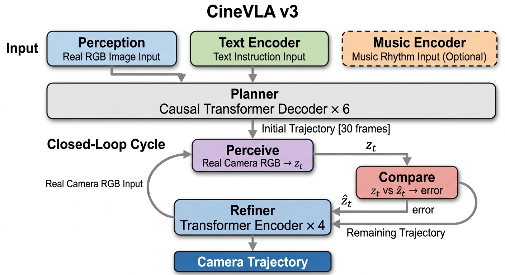

# CineVLA: 闭环视觉反馈相机轨迹生成

CineVLA 是一个闭环视觉-语言-动作系统。模型在每一步运动后真正"看一眼"附近的 RGB 环境，用这个真实的视觉信号来修正后续轨迹。




## 架构

```
Phase 1: 初始规划
  RGB 帧序列 + 文本 → Video Perception → Planner → 初始轨迹

Phase 2: 闭环执行
  camera 走到 p_t → 捕捉当前帧
  Perception(当前帧) → z_t（真实环境感知）
  z_t vs 预测的 ẑ_t → 感知误差
  Refiner → 修正剩余轨迹 + 预测下一帧状态
  camera 走到修正后的 p_{t+1}
```

## 三个组件

| 组件 | 功能 |
|------|------|
| Video Perception | CLIP ViT-B/32 + 时序 Transformer，从 RGB 帧序列中提取 3D 感知特征 |
| Planner | 因果 Transformer，从帧序列特征 + 文本生成初始轨迹 |
| Refiner | 轻量 Transformer，用真实帧特征 vs 预测特征的误差修正轨迹 |

## 安装

```bash
conda create --name cinevla python=3.10
conda activate cinevla
pip install -r requirements.txt --break-system-packages
```

## 训练

```bash
python train.py default --workspace workspace --exp_name run1
```

## 推理

```bash
# 单张图片
python eval.py default --image_path "scene.jpg" --text "镜头推进..." --resume "ckpt.safetensors"

# 帧序列目录
python eval.py default --image_path "frames/" --text "..." --resume "ckpt.safetensors"

# MP4 视频
python eval.py default --image_path "video.mp4" --text "..." --resume "ckpt.safetensors"
```

## 数据集结构

```
dataset/
├── train_valid.txt              # 一行一个样本路径: {VideoID}/{ShotID}
├── 1_0000/                      # VideoID 目录
│   ├── shot_0070_rgb.png        # 第一帧 RGB 图像（任意分辨率，训练时 resize 到 224×224）
│   ├── shot_0070_caption.json   # 文本描述
│   ├── shot_0070_transforms_cleaning.json  # 相机轨迹
│   └── shot_0070_frames/        # （可选）多帧序列目录
│       ├── 000.png
│       ├── 001.png
│       └── ...
├── 1_0001/
│   └── ...
└── ...
```

### 文件格式

**`_caption.json`**

```json
{
    "Movement": "相机右移后上仰...",
    "Detailed Interaction": "...",
    "Concise Interaction": "简洁的导演意图描述"
}
```

训练时随机选一个 key，优先 `Concise Interaction`。

**`_transforms_cleaning.json`**

```json
{
    "w": 1920,
    "h": 1080,
    "fl_x": 1200.0, "fl_y": 1200.0,
    "cx": 960.0,  "cy": 540.0,
    "frames": [
        {"transform_matrix": [[1,0,0,0],[0,1,0,0],[0,0,1,0],[0,0,0,1]]},
        ...
    ]
}
```

`frames` 数组至少 120 帧（等距采样 30 帧做轨迹）。`transform_matrix` 为 4×4 c2w 矩阵。

**`_frames/` 目录（可选）**

放多个 PNG 帧文件（文件名排序后按序读取，取前 8 帧）。如果不存在该目录，训练时自动通过随机裁剪 + 亮度扰动从单帧生成伪多帧序列。

