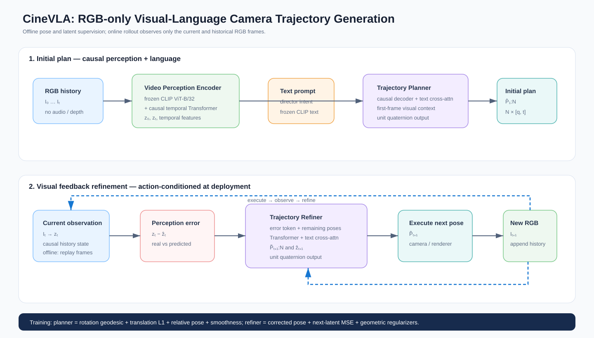

# CineVLA

<p align="center"></p>

**CineVLA** is an RGB-only visual-language model for camera trajectory generation. From observed RGB frames and a director-style text instruction, it predicts an initial camera path and refines the remaining path using visual feedback.

This repository is a research baseline: model components, staged training, deterministic validation, offline replay evaluation, and fast contract tests are implemented. An action-conditioned renderer or real-camera experiment is intentionally a later milestone, not a claim made by current offline results.

## Components

| Component | Input | Output | Purpose |
| --- | --- | --- | --- |
| Video Perception Encoder | RGB sequence | causal per-frame latents | frozen CLIP ViT-B/32 + temporal Transformer |
| Trajectory Planner | first-frame latent + text | initial `N × 7` poses | language-conditioned causal decoder |
| Trajectory Refiner | latent error + remaining plan + text | corrected poses + next latent | visual feedback correction |
| Training pipeline | samples, poses, captions | staged checkpoints | planner → refiner → joint training |

Poses use `[qw, qx, qy, qz, tx, ty, tz]`; planner and refiner normalize their quaternion outputs. Audio and depth are not model inputs.

## Method

The perception encoder produces causal visual latents: the state at time `t` accesses only frames `0…t`. The planner consumes the first-frame latent and frozen CLIP text features to generate an initial pose sequence.

At rollout step `t`, the refiner compares observed `z_t` with previous prediction `ẑ_t`. It conditions on this error, text, and the remaining plan to predict corrected poses and `ẑ_{t+1}`. Deployment must expose a new RGB frame only after the preceding pose is executed.

`OfflineReplayEnv` tests this temporal contract on held-out video, but does not render images based on submitted poses. Therefore replay-only results are not action-conditioned closed-loop metrics. See [the environment interface](docs/environment.md).

## Installation

```bash
conda create --name cinevla python=3.10
conda activate cinevla
pip install -r requirements.txt
```

CLIP weights download on first use. A GPU is recommended for training.

## Dataset contract

Every item needs RGB frames (or a video), a caption JSON, and c2w camera transforms:

```text
dataset/
├── DataDoP/train_valid.txt       # {VideoID}/{ShotID}, one item per line
└── {VideoID}/
    ├── {ShotID}_caption.json
    ├── {ShotID}_transforms_cleaning.json
    ├── {ShotID}_video.mp4
    └── {ShotID}_frames/
        ├── 000.png
        └── ...
```

Use either `_video.mp4` or `_frames/`; each needs at least `num_frames` images. The loader samples the trajectory length and converts c2w transforms to quaternion-plus-translation poses.

## Training

```bash
python train.py default \
  --workspace workspace \
  --exp_name baseline_v1 \
  --data_path /path/to/dataset
```

Training is staged: (1) planner pretraining with progressive trajectory length, (2) refiner pretraining from detached planner trajectories, then (3) joint end-to-end training.

Every epoch runs deterministic validation. `best_planner.safetensors`, `best_refiner.safetensors`, and `best.safetensors` are selected by validation loss. `last.safetensors` is paired with `last.training.pt`, which restores optimizer, scheduler, stage/epoch, and RNG state:

```bash
python train.py default --resume workspace/baseline_v1/last.safetensors
```

Options live in [core/options.py](core/options.py); loss details are in [docs/loss](docs/loss/overview.md).

## Evaluation

```bash
python eval.py default \
  --image_path /path/to/shot_frames \
  --text "slow dolly forward, then pan left" \
  --resume workspace/baseline_v1/best.safetensors

python -m evaluate.eval_benchmark \
  --resume workspace/baseline_v1/best.safetensors \
  --data_path /path/to/dataset \
  --output_csv metrics/baseline_v1.csv
```

| Metric | Meaning |
| --- | --- |
| `pose/rotation_deg` | quaternion geodesic rotation error in degrees; lower is better |
| `pose/translation_l1` | mean translation-coordinate error in normalized dataset space; lower is better |
| `pose/translation_l2` | Euclidean translation error in normalized dataset space; lower is better |

FCD, PRDC, and CLaTr are disabled unless a separately pretrained trajectory encoder is supplied:

```bash
python -m evaluate.eval_benchmark ... \
  --trajectory_encoder /path/to/pretrained_trajectory_encoder.safetensors
```

## Verification

Fast tests do not download model weights; they cover causal masks, replay behavior, pose supervision, all training stages, and quaternion normalization.

```bash
PYTEST_DISABLE_PLUGIN_AUTOLOAD=1 python -m pytest -q tests
```

## Research roadmap

1. Build and audit a large RGB–text–camera-pose dataset.
2. Fix data splits and normalization rules; run planner/refiner ablations.
3. Train a fixed trajectory-text encoder only if distribution metrics are needed.
4. Add an action-conditioned renderer or real-camera adapter and report closed-loop recovery separately from offline pose error.

## Repository map

```text
assets/      architecture figures
core/        model, data, losses, metrics, options
docs/        training, loss, and environment notes
envs/        causal environment interfaces and offline replay
evaluate/    held-out benchmark entry point
tests/       causal and model smoke tests
```

## License and citation

Add the intended license and `CITATION.cff` before a public research release.
